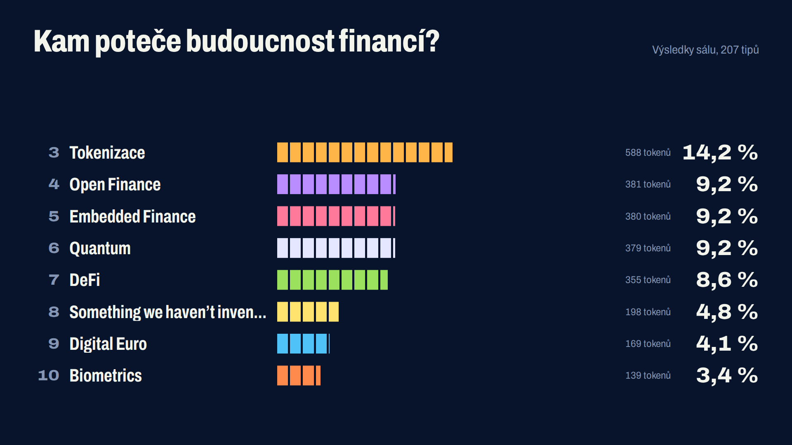

# Trendová hra: kam poteče budoucnost financí

Živá hra pro zhruba 200 účastníků. Hráči načtou QR kód, zvolí přezdívku a na telefonu rozdělí tokeny mezi deset trendů. LED obrazovka ukazuje průběh hlasování, pak dramaticky odhalí rozložení sálu a vyhlásí vítěze, jejichž tip se se sálem shodoval nejvíc.



## Spuštění na vlastním počítači

Potřebuješ Node.js 18 nebo novější.

```bash
npm install
ADMIN_KEY=tajneheslo npm start
```

Server vypíše tři adresy:

| Adresa | K čemu slouží |
|---|---|
| `http://<ip>:3000/` | stránka hráče (na ni vede QR kód) |
| `http://<ip>:3000/screen` | LED obrazovka, otevři v prohlížeči na celou obrazovku (F11) |
| `http://<ip>:3000/admin#tajneheslo` | řízení hry |

Bez `ADMIN_KEY` se vygeneruje náhodný klíč, který se po každém restartu změní.

## Proměnné prostředí

| Proměnná | Výchozí | Význam |
|---|---|---|
| `PORT` | `3000` | port serveru |
| `PUBLIC_URL` | odvozeno z adresy | veřejná adresa pro QR kód, např. `https://hra.firma.cz`. Na Renderu se převezme automaticky. |
| `ADMIN_KEY` | náhodný | klíč do administrace |
| `DATA_DIR` | `./data` | kam se průběžně ukládá stav hry, pokud není nastaven `DATABASE_URL` |
| `DATABASE_URL` | nenastaveno | PostgreSQL pro uložení stavu. Nutné na hostingu, kde restart maže disk (Render Free). |

## Nasazení na internet

**Zdarma:** podrobný návod krok za krokem je v [DEPLOY-RENDER.md](DEPLOY-RENDER.md) (Render Free + free Postgres, bez karty a bez příkazové řádky).

**Placeně:** hosting musí podporovat WebSockety. Vhodné jsou Railway, Render s placeným tarifem, Fly.io nebo vlastní VPS. Přiložený `Dockerfile` funguje všude.
- Nastav `ADMIN_KEY`.
- Nastav buď `DATABASE_URL`, nebo trvalý disk pro `DATA_DIR`.
- Nastav `PUBLIC_URL`, pokud ji hosting nedodá sám.

Hra běží v paměti jednoho serveru a ukládá se průběžně (s prodlevou 0,4 s a při vypnutí serveru okamžitě). **Nespouštěj víc instancí zároveň**, hlasy by se rozdělily mezi ně.

## Průběh akce

1. **Před akcí:** v administraci klikni na „Smazat všechna data“ (napiš RESET). Otevři `/screen` na LED počítači.
2. **Lobby s QR:** obrazovka ukáže QR kód a počet připojených. Hráči se mohou připojit a rozdělit tokeny, odeslat zatím nemohou.
3. **Spustit hlasování:** zadej počet minut (doporučeno 3). Po uplynutí se hlasování samo uzavře. Časovač jde prodloužit o minutu.
4. **Uzavřít:** pořadí se zmrazí, pozdní tipy už server nepřijme.
5. **Odhalit výsledky:** sloupce naskakují od 10. místa, první tři s pauzou. Celé odhalení trvá asi 14 sekund.
6. **Vyhlásit vítěze:** stupně vítězů a místa 4–10. Každý hráč uvidí na telefonu své pořadí a shodu.
7. **Po akci:** „Stáhnout CSV“ obsahuje všechny tipy, skóre a pořadí (otevře se v Excelu).

Nevhodnou přezdívku přejmenuješ nebo odebereš v tabulce hráčů. Změna se hned projeví na obrazovce.

## Pravidla (text k moderování)

Každý má 20 tokenů a rozdělí je nejvýše mezi 5 trendů. Vyhrává ten, jehož rozdělení se nejvíc shoduje s rozdělením celého sálu.

**Shoda** je součet překryvů přes všechny trendy: když dáš trendu 30 % a sál mu dá 20 %, započítá se 20. Tvůj vlastní tip se do „sálu“ nepočítá. Maximum je 100 %.

**Při rovnosti** rozhoduje nejdřív menší kvadratická odchylka, pak dřívější odeslání.

### Proč zrovna tato čísla

Pravidla jsou ověřená simulací (`test/strategy-sim.py`, 200 hráčů, stovky opakování):

- **Bez limitu trendů:** rovnoměrné rozprostření tokenů na všech 10 trendů porazí asi 79 % poctivých hráčů. Hra by degenerovala.
- **Limit 5:** rozprostření skončí pod průměrem (kolem 35. percentilu).
- **Limit 3:** v průměru 15 hráčů má stejné nejvyšší skóre, takže by rozhodoval čas odeslání.
- **Proč 20 tokenů:** 100 tokenů po pěti nesnižuje počet remíz (asi 2 v obou případech), jen zdržuje na telefonu.
- **Živý graf během hlasování:** hráč, který opíše aktuální rozložení, porazí 99 % ostatních. Proto je výchozí slepé hlasování. Živý graf jde zapnout v administraci, ale férovost tím končí.

## Úpravy

Vše podstatné je v `config.js`: nadpis, podtitul, počet tokenů, limit trendů, názvy a barvy trendů. Po změně restartuj server.

Pokud změníš tokeny, limit nebo ID trendů, starý uložený stav se při startu automaticky odloží do zálohy.

**Jiný poměr stran LED panelu:** otevři `/screen?w=3840&h=1080` (plátno se škáluje do okna). Rozvržení je odladěné pro 16:9. Pro velmi široké panely počítej s úpravou CSS.

## Testování

```bash
# v jednom terminálu
ADMIN_KEY=test npm start
# ve druhém: 200 skutečných spojení, neplatné tipy, kontrola skóre nezávislým výpočtem
ADMIN_KEY=test npm run test:load
```

**Pozor, test smaže data na serveru.**

Pro generálku bez telefonů použij v administraci „Přidat testovací hráče“. Připojí se ihned a během hlasování postupně posílají tipy. Před ostrou hrou je odeber.

Simulace strategií potřebuje Python s numpy: `python3 test/strategy-sim.py 5`.

## Známá omezení

- **Opakované hlasování:** hráč je rozpoznán podle úložiště prohlížeče. Kdo ho smaže nebo použije anonymní okno, může hrát znovu pod jinou přezdívkou. Proti tomu by pomohlo jen přihlašování, což by u akce odradilo lidi.
- **Wi-Fi v sále:** 200 telefonů na jedné síti často selže. Stránka hráče má při prvním načtení asi 240 kB včetně písma (změřeno), takže mobilní data bez problému stačí.
- **Hodnocení je pouze vůči sálu,** ne vůči skutečnému vývoji trendů. Vítěz je ten, kdo nejlépe odhadl názor publika.
